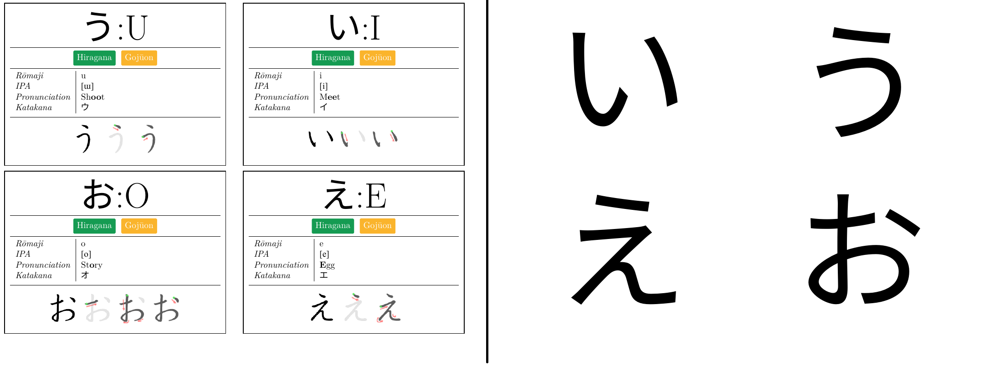

# Japanese Kana Learning Flashcards

This is a set of flashcards to help learn Hiragana and Katakana.

-----
# [Download](flashcards.pdf)

The structure and data is based on wikipedia articles on [Hiragana](https://en.wikipedia.org/wiki/Hiragana) & [Katakana](https://en.wikipedia.org/wiki/Katakana). It itegrate all in use gojūon & yōon with (han)dakuten variants.

I recommend printing it on hard paper to allow them to not be sturndy enough and not see through in bright light.

Please note that **it may contain error**. If you find any, please kindly open an issue here.

I'm in no way a japaneese instructor, only a french guy trying to learn :-)

## Build requirement

You will need :
 - XeLatex
 - Font :
   - [Noto Sans JP](https://fonts.google.com/noto/specimen/Noto+Sans+JP) (For Japanese Characters)
   - [Doulos SIL](https://software.sil.org/doulos/) (For IPA)
 - Latex Packages :
   - flashcards
   - xcolor
   - tcolorbox
   - graphicx
   - tabularx
   - xeCJK
   - fontspec

Main file is flashcards.tex

Tested with MikTex & TexWorks on Windows 11

## Improvement axes
 - Find pronunciation exemple for missing Kana : [Mapping List](Exemples.md)
 - Find a way to put a front printing/usage instruction page in the latex document
 - Improve Latex structure

## Licence
This work is licenced as CC BY SA 4.0

Detail of the included image licence here : [Picture Licences List](PicturesLicences.md)